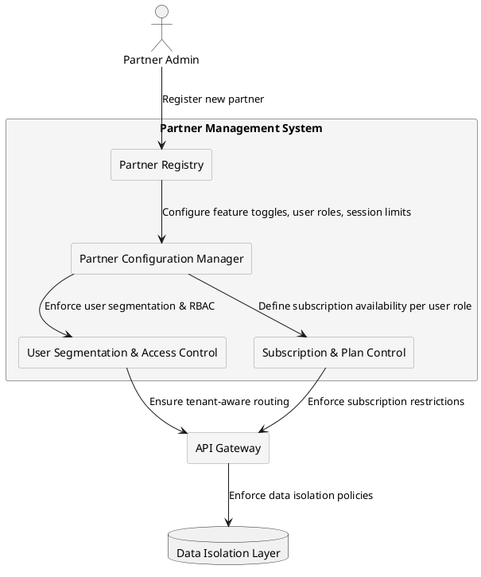

# **Partner Management Model**

## **Overview**
The **Partner Management Model** defines how different partners (providers) interact with the system while maintaining strict **data isolation, configuration independence, and regulatory compliance**. The architecture ensures that:

- Each partner has **isolated user bases**, preventing cross-tenant interactions.
- **Feature sets, subscription plans, and access permissions** are configurable per partner.
- Partners **operate independently**, ensuring no interference between providers.
- **Data security and compliance standards** are enforced across all partners.

---

## **Key Components**

### **1. Partner Registry**
   - Stores all **registered partners** with metadata, including:
     - **Partner ID**
     - **Business Name**
     - **Onboarding Date**
     - **Status (active, stopped)**
   - Maintains **partner lifecycle state**, allowing updates or deactivation.

### **2. Partner Configuration Manager**
   - Controls **feature toggles** per partner.
   - Defines **available user roles**, **RBAC policies**, and **session limits**.
   - Configures **subscription plans** that a partner can offer to their users.
   - Allows **custom policy enforcement**, such as **rate-limiting or API access control**.

#### **Feature Toggles (Feature Flags)**
Feature toggles (also known as **feature flags**) allow dynamic **enabling or disabling of system functionalities** per partner without modifying the core application logic. They are used for:

- **Customizing feature availability per partner** (e.g., enabling beta features for select partners).
- **Rolling out new functionalities incrementally** to prevent disruptions.
- **Allowing partners to opt in or out of specific features** based on their business needs.

Feature toggles are stored in the **Partner Configuration Manager** and applied dynamically via **RBAC and API Gateway rules**.

##### **Example Use Case:**
- Partner A has **Feature X** enabled, while Partner B does not.
- Partner C gets access to an **early release of Feature Y** before a global rollout.

Feature toggles provide flexibility, allowing partners to experiment with and control their system behavior without requiring new deployments.

---

### **3. User Segmentation & Access Control**
   - Ensures strict **data and user isolation** between partners.
   - Restricts **cross-partner interactions**, preventing unauthorized access.
   - Assigns **partner-specific access rules** for:
     - **Role-Based Access Control (RBAC)**
     - **Session & Usage Policies**
     - **Subscription Availability**

### **4. API Gateway with Tenant-Aware Routing**
   - Routes **partner-specific requests** to the appropriate services.
   - Enforces **partner-level authentication**, including:
     - **Basic Authentication** for administrative endpoints.
     - **Token-based authentication** for user-based requests.
   - Applies **rate limits and security policies** per partner.

### **5. Subscription & Service Plan Control**
   - Defines which **subscription plans** are **available per partner**.
   - Manages **plan restrictions** for eligible user roles (`basic`, `company`, `advanced`).  
     - **Guest users must first complete KYC** to become eligible for subscription plans.  
   - Ensures **real-time enforcement** of subscription policies, including:  
     - **Subscription initiation & confirmation** (`signing → confirmed`).  
     - **Suspension of subscriptions** (e.g., due to non-payment or policy violations).  
   - Limits **plan availability** based on **partner-specific configurations**.

### **6. Data Isolation Layer**
   - Implements **logical** or **physical** separation of partner data.
   - Uses **tenant-aware schemas** or **row-level security (RLS)**.
   - Prevents **cross-tenant access**, ensuring strict data security.

---

## **Partner Management Flow**

Below is a diagram illustrating the **Partner Management Model**:

---

## **Summary**
The **Partner Management Model** ensures:

✅ **Strict isolation** between partner users and configurations.  
✅ **Customizable access control** via **RBAC, session policies, and API rules**.  
✅ **Subscription management per partner**, enforcing role-based plan availability.  
✅ **Scalable architecture**, enabling **independent partner operations**.  
✅ **Feature toggles allow partners to selectively enable or disable system functionalities** without affecting global operations.

For further details, see:

- **[User Roles and Transitions](../security/rbac.md)**
- **[Subscription Plans & Partner Restrictions](../subscriptions/plan_restrictions.md)**
- **[Multi-Tenancy & Data Isolation](../security/multi_tenancy.md)**
