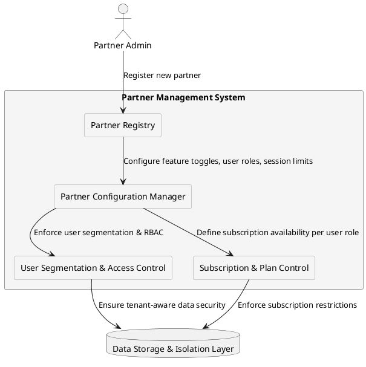

# Partner Management Model

## Overview

The Partner Management Model defines how different partners (providers) interact with the system while maintaining strict data isolation, configuration independence, and regulatory compliance. The architecture ensures that:

- Each partner has isolated user bases, preventing cross-tenant interactions.
- Feature sets, subscription plans, and access permissions are configurable per partner.
- Partners operate independently, without interfering with one another.
- Data security and compliance standards are enforced across all partners.

---

## Key Components

### Partner Registry

- Stores all registered partners with metadata, e.g.:

    - Partner ID  
    - Business Name  
    - Onboarding Date  
    - Status (`active`, `stopped`)  

- Maintains partner lifecycle state, allowing updates or deactivations.

### Partner Configuration Manager

- Controls feature toggles per partner.
- Defines available user roles, RBAC policies, and session limits.
- Configures subscription plans that a partner can offer to their users.
- Allows custom policy enforcement, such as rate-limiting or API access control.

**Feature Toggles**

Feature toggles allow dynamic enabling or disabling of system functionalities per partner without modifying the core application logic. They are used for:

- Customizing feature availability per partner (e.g., enabling beta features for select partners).
- Rolling out new functionalities incrementally to prevent disruptions.
- Allowing partners to opt in or out of specific features based on their business needs.

Feature toggles are stored in the Partner Configuration Manager and applied dynamically via RBAC rules.

##### Example Use Case:

- Partner A has Feature X enabled, while Partner B does not.
- Partner C gets access to an early release of Feature Y before a global rollout.

---

### User Segmentation & Access Control  

- Enforces **data isolation**, ensuring each partner's users and records remain separate.  
- Blocks **cross-partner authentication and access** to prevent unauthorized interactions.  
- Applies partner-specific rules for:  

    - **RBAC** – Limits user actions based on assigned roles.  
    - **Session & Usage Policies** – Defines timeouts, rate limits, and quotas.  
    - **Subscription Access** – Controls plan availability by user role.  

### Subscription & Service Plan Control

- Defines which subscription plans are available per partner.
- Manages plan restrictions for eligible user roles (`basic`, `company`, `advanced`).  

    - Guest users must first complete KYC to become eligible for subscription plans.  

- Ensures real-time enforcement of subscription policies, including:  

    - Subscription initiation & confirmation (`signing → signed`).  
    - Suspension of subscriptions (e.g., due to non-payment or policy violations).  

- Limits plan availability based on partner-specific configurations.

### Data Storage & Isolation Layer

- Implements logical or physical separation of partner data.
- Uses tenant-aware schemas or row-level security (RLS).
- Prevents cross-tenant access, ensuring strict data security.

---

## Partner Management Flow

Below is a diagram illustrating the Partner Management Model:

---

## Related Sections

- [System Components](system_components.md)
- [User Management Model](user_management.md)

---

© 2025 CompanyName. Internal use only.
