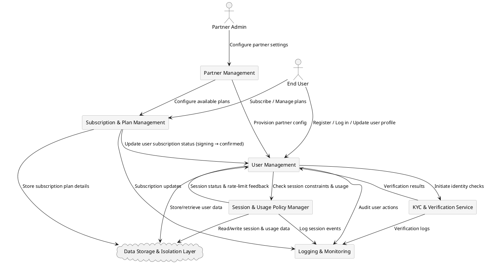

# **System Components**

The system consists of several key components that work together to provide **multi-tenant functionality, user management, session control, and subscription handling**. Below is an **interaction flow** illustrating how these components communicate.

---

## **Partner Management**
- Manages the **onboarding and configuration** of partners (providers).  
- Stores **partner-specific settings**, such as available **user roles, feature toggles, branding, operational limits, and subscription plan availability**.  
- Ensures that **each partner operates independently**, without affecting other tenants.

---

## **User Management**
- Creates, updates, and maintains **user records across multiple partners**.  
- Controls **user roles, statuses, and permissions** based on **partner-specific configurations**.  
- **Enforces RBAC (Role-Based Access Control)** for **feature access restrictions per role**.  
- Manages **user subscription status** (e.g., `signing`, `confirmed`, `suspended`).  
- Works with the **Subscription & Plan Management** service to **synchronize user status with subscription states**.  

---

## **Session & Usage Policy Manager**
- Monitors **active user sessions and operational quotas** (e.g., daily/weekly limits).  
- Enforces **session expiration policies**, including:  
  - **Guest session expiration** (20-minute limit).  
  - **Basic user inactivity timeouts** (partner-defined).  
  - **Restricted state handling** for users exceeding operational limits.  
- Ensures **Idle State and Restricted State enforcement** per **partner policies**.

---

## **Subscription & Plan Management**
- Handles **subscription lifecycle events**, including:  
  - **Plan creation, updates, and deletions** (API-controlled).  
  - **Subscription initiation & confirmation** (`signing → confirmed`).  
  - **Suspension of subscriptions** (e.g., due to non-payment or policy enforcement).  
- Limits plan availability **to specific user roles**, as defined in **partner policies**.  
- Ensures **subscription status transitions** between `signing`, `confirmed`, and `suspended`.  
- Works with the **User Management** component to update **user status** based on subscription changes.

---

## **KYC & Verification Service**
- Provides **identity verification for user upgrades** from `guest` to `basic` or `advanced`.  
- Integrates with **external and internal verification sources** to comply with partner security requirements.  
- Enforces **re-verification workflows** (e.g., for expired KYC documents).

---

## **Data Storage & Isolation Layer**
- **Separates partner data** using **tenant-aware schemas and row-level security (RLS)**.  
- Ensures **zero data leakage** between different partners.  
- Supports **multi-region data storage** for compliance with local regulations.  

---

## **Logging & Monitoring**
- **Captures system events** for auditing, debugging, and compliance.  
- Provides **real-time visibility** into usage patterns, errors, and security alerts.  
- Integrates **with external SIEM solutions** for advanced security monitoring.

---

## **Component Interaction Diagram**

---

## **Summary**
The **modular architecture** ensures:
✅ **Strict tenant isolation** for user and subscription data.  
✅ **Granular access control** via **RBAC & session enforcement**.  
✅ **Subscription plan customization** per **partner policies**.  
✅ **Efficient security monitoring** through logging & auditing.

For further details, see:

- **[Partner Management Model](./partner_management.md)**
- **[User Roles and Transitions](../security/rbac.md)**
- **[Subscription Lifecycle](../subscriptions/subscription_lifecycle.md)**
