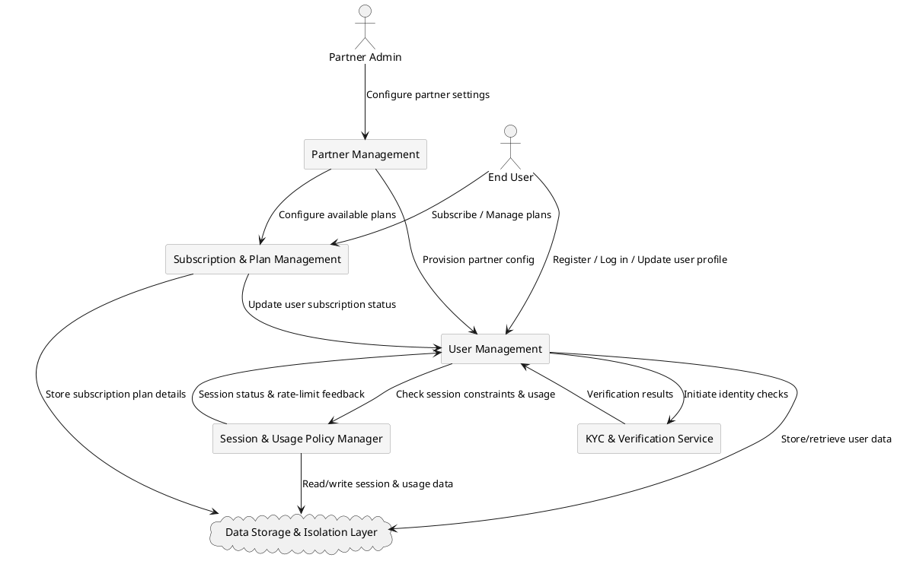

# System Components

The system consists of several key components that provide multi-tenant functionality, user management, session control, and subscription handling. Below is an overview of each component and their interactions.

---

## Partner Management

- Manages onboarding and configuration of partners (providers).  
- Stores partner-specific settings, including:  

    - User roles and their associated feature toggles.  
    - Branding and operational limits.  
    - Subscription plans available for different user types.  

- Ensures tenant isolation, preventing one partner’s configuration from affecting another.

---

## User Management

- Maintains user records across multiple partners.  
- Controls roles, statuses, and permissions based on partner-defined policies.  
- Enforces role-based access control (RBAC) for user types.  
- Manages user state transitions.
- Manages user subscription states via the subscription management service.

---

## Session & Usage Policy Manager

- Monitors active sessions and usage limits.  
- Enforces session expiration policies, including:  

  - Guest session timeout (20-minute limit).  
  - Basic user inactivity timeouts (configurable per partner).  
  - Enforcement of restricted states for users exceeding operational limits.  

- Ensures compliance with partner-specific session rules.

---

## Subscription & Plan Management

- Handles subscription lifecycle events, including:  

  - Plan creation, updates, and deletions.  
  - Subscription initiation and confirmation.  
  - Suspension due to non-payment or policy violations.  

- Limits plan availability to specific user roles as defined by the partner.  
- Tracks subscription state transitions.
- Interacts with user management to update user status when a subscription is initiated or confirmed.

---

## KYC & Verification Service

- Provides identity verification for user type upgrades, including:  

    - `guest → basic`  
    - `basic → advanced`  

- Integrates with internal and external verification sources.  
- Supports re-verification workflows when required.

---

## Data Storage & Isolation Layer

- Ensures partner data separation using:  

    - Tenant-aware schemas  
    - Row-level security (RLS)  

- Prevents data leakage between tenants.  
- Supports multi-region data storage for compliance with local regulations.

---

## Component Interaction Diagram

---

## Related Sections:

- [Partner Management Model](partner_management.md)
- [User Management Model](user_management.md)

---

© 2025 CompanyName. Internal use only.
