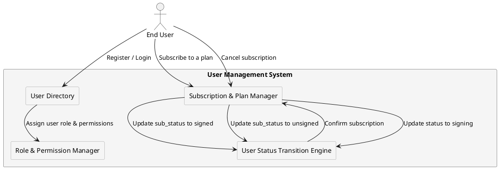

# User Management Model

## Overview

The User Management Model defines how users are created, managed, authenticated, and transitioned between roles and subscription states. Each partner (provider) maintains an isolated user base, ensuring:

- Strict user separation between partners.  
- Role-based access control (RBAC) configurable per partner.  
- User lifecycle management, including account status (`status`) and subscription status (`sub_status`).  
- Subscription control, enforcing plan availability restrictions per partner.  

---

## Key User Attributes

### User Identification

Each user is uniquely identified within the system by:

- `user_id` → Unique identifier (7-character string).  
- `provider_id` → Identifies the partner the user belongs to (4-character string).  

---

## User Roles

Users are assigned one of the following roles, which define their access level and available features:

| Role      | Description |
|-----------|----------------|
| `guest`   | Unverified user with limited access; cannot subscribe to plans. |
| `basic`   | Verified user with access to certain plans. |
| `advanced` | Upgraded user with more subscription options. |
| `company` | Corporate-level user with full plan access. |
| `admin`   | System administrator; cannot subscribe to plans. |

> Guest and Admin users cannot subscribe to plans.

---

## User Status (`status`) vs. Subscription Status (`sub_status`)

The system tracks users through two independent statuses:

| Type                 | Field        | Scope        | Effects |
|----------------------|-------------|-------------|---------|
| User status         | `status`     | Affects all user actions (login, API access, transactions). | Determines if the user can access the system. |
| Subscription status | `sub_status` | Affects only subscription-based features. | Controls access to partner-managed subscription services. |

### User Status (`status`)

Defines a user’s service state, affecting their ability to perform operations:

| Status    | Description |
|-----------|----------------|
| `active`  | User is fully functional and can perform all allowed actions. |
| `inactive` | User is temporarily restricted from operations (e.g., admin-imposed block, security hold). |
| `idle`    | User has exceeded usage limits or session timeouts. |
| `signing` | User is in the process of subscribing to a plan. |

> An `inactive` user cannot log in or perform any system actions. This restriction is account-wide and is not related to subscription status.

---

### Subscription Status (`sub_status`)

Tracks the user’s subscription state. It is read-only and cannot be modified via API requests.

| Sub-status  | Description |
|------------|----------------|
| `absent`   | The user has never subscribed to a plan. |
| `signed`   | The subscription is active, and the user has access to the plan's features. |
| `unsigned` | The user was previously subscribed but has no active plan. |
| `suspended` | The subscription is temporarily disabled due to payment issues, policy violations, or partner actions. |

- New users start with `sub_status: absent`.  
- When a user subscribes, they transition directly from `absent` to `signed`.  
- Unsubscribing moves the user from `signed` to `unsigned`.  
- A suspended subscription can return to `signed` or transition to `unsigned`.  

---

## User Lifecycle & Role Transitions

Users progress through different roles and subscription states based on verification, partner policies, and subscription changes.

### Guest to Basic (KYC Completion)

- Guests must complete KYC verification to gain access to subscriptions.
- Transition:  
  `guest` → `basic` (`status: active`, `sub_status: unsigned`)

---

### Subscribing to a Plan

- A basic, advanced, or company user subscribes to a plan.
- Their `status` changes to `signing` while the subscription is being processed.
- Upon confirmation, `status` returns to `active`, and `sub_status` updates to `signed`.

**Transition Examples:**

| Before Subscription | During Subscription | After Confirmation |
|---------------------|--------------------|--------------------|
| `status: active`, `sub_status: unsigned` | `status: signing`, `sub_status: unsigned` | `status: active`, `sub_status: signed` |

---

### Canceling a Subscription

- When a user cancels their subscription, `sub_status` changes to `unsigned`, but `status` remains `active`.
- If a partner discontinues a plan, affected users are forcefully transitioned to `unsigned`.

---

### Suspending a Subscription

- If a payment issue or violation occurs, the user’s subscription may be suspended.
- Suspended subscriptions can either be restored (`signed`) or removed (`unsigned`).

**Transition Example:**

| Previous State | Trigger | New State |
|---------------|---------|-----------|
| `sub_status: signed` | Payment issue detected | `sub_status: suspended` |
| `sub_status: suspended` | Issue resolved | `sub_status: signed` |
| `sub_status: suspended` | Issue unresolved (final termination) | `sub_status: unsigned` |

---

## User Management Flow

The following diagram illustrates how user status and subscription status interact in the system:

---

## Related Sections

- [Partner Management Model](partner_management.md)
- [Role-Based Access Control (RBAC)](../security/rbac.md)

---

© 2025 CompanyName. Internal use only.
