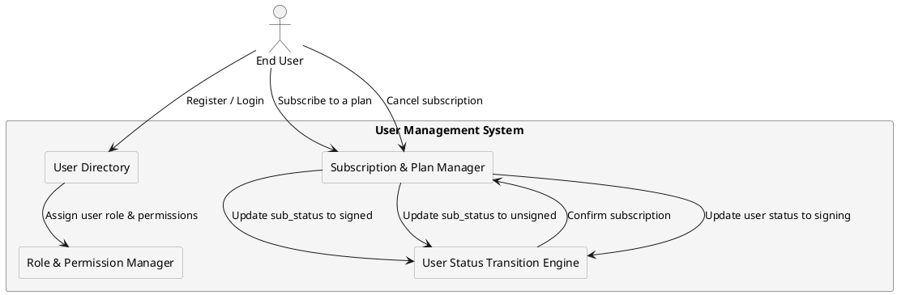

# **User Management Model**

## **Overview**
The **User Management Model** defines how users are created, managed, authenticated, and transitioned between roles and subscription states. Each partner (provider) maintains an **isolated user base**, ensuring:

- **Strict user separation** between partners.
- **Role-Based Access Control (RBAC)** configurable per partner.
- **User lifecycle management**, including **status transitions and subscription states**.
- **Subscription control**, enforcing plan availability restrictions per partner.

---

## **Key User Attributes**

### **1. User Identification**
Each user is uniquely identified within the system by:
- **`user_id`** → Unique identifier (7-character string).
- **`provider_id`** → Identifies the partner the user belongs to (4-character string).

### **2. User Roles**
Users are assigned one of the following **roles**, which define their access level and available features:

| **Role**    | **Description** |
|------------|----------------|
| `guest`    | Unverified user with **limited access**; cannot subscribe to plans. |
| `basic`    | Verified user with access to **certain plans**. |
| `advanced` | Upgraded user with **more subscription options**. |
| `company`  | Corporate-level user with **full plan access**. |
| `admin`    | System administrator; cannot subscribe to plans. |

> **Guest and Admin users cannot subscribe to plans**.

### **3. User Status (`status`)**
The **`status`** field defines a user’s **service state**, affecting their ability to perform operations.

| **Status**  | **Description** |
|------------|----------------|
| `active`   | User is active and can perform all allowed actions. |
| `inactive` | User is temporarily restricted from operations. |
| `idle`     | User has exceeded usage limits or session timeouts. |
| `signing`  | User is in the **process of subscribing** to a plan. |

- **When a user initiates a subscription**, their status changes to `signing`.
- **Once confirmed, `status` returns to `active`**.

### **4. Subscription Status (`sub_status`)**
The **`sub_status`** field tracks the user’s **subscription state**. It is **read-only** and cannot be modified via API requests.

| **Sub-Status**  | **Description** |
|----------------|----------------|
| `signed`       | User has an **active subscription**. |
| `unsigned`     | User **does not have a subscription**. |
| `absent`       | Subscription information is **not yet assigned** (e.g., newly registered user). |

- **Subscription confirmation updates `sub_status` to `signed`**.
- **Subscription cancellation resets `sub_status` to `unsigned`**.

---

## **User Lifecycle & Role Transitions**
Users progress through different roles and subscription states based on **verification, partner policies, and subscription changes**.

### **1. Guest to Basic (KYC Completion)**
- Guests must **complete KYC verification** to gain access to **subscriptions**.
- Transition:  
  **`guest` → `basic` (status: active, sub_status: unsigned)**

### **2. Subscribing to a Plan**
- A **Basic, Advanced, or Company user** subscribes to a plan.
- Their **status changes to `signing`** while the subscription is being processed.
- Upon confirmation, **status returns to `active`, and `sub_status` updates to `signed`**.

**Transition Example:**
1. **Before Subscription** → `basic`, `status: active`, `sub_status: unsigned`
2. **During Subscription** → `basic`, `status: signing`, `sub_status: unsigned`
3. **After Confirmation** → `basic`, `status: active`, `sub_status: signed`

### **3. Canceling a Subscription**
- When a user **cancels their subscription**, `sub_status` changes to `unsigned`, but **status remains `active`**.
- If a partner discontinues a plan, affected users **are forcefully transitioned to `unsigned`**.

### **4. Subscription Suspension**
- If a **payment issue or violation occurs**, the user’s subscription may be **suspended**.
- **Suspended subscriptions can either be restored (`signed`) or removed (`unsigned`)**.

**Transition Example:**
1. **Active Subscription** → `sub_status: signed`
2. **Suspended (Issue Detected)** → `sub_status: suspended`
3. **Issue Resolved** → `sub_status: signed`
4. **Issue Unresolved (Final Termination)** → `sub_status: unsigned`

---

## **User Management Flow**
The following diagram illustrates the **core user lifecycle**:

---

## **Authentication & Session Control**
The system **authenticates users** via session-based tokens and enforces:
- **Partner-defined session expiration policies**.
- **Rate limits** to prevent abuse.
- **Idle session handling** (affects `status`, but not `sub_status`).

> **Subscribing (`signing`) does not affect active sessions**.

---

## **Summary**
- **`status` controls service access**, while **`sub_status` tracks subscriptions**.
- **Users can only modify `status` through actions**, while **`sub_status` changes automatically**.
- **Guest and Admin users cannot subscribe**.
- **Subscription changes follow a structured lifecycle (`unsigned → signing → signed`)**.

For related details, see:
- **[User Roles & Transitions](../security/rbac.md)**
- **[Subscription Lifecycle](../subscriptions/subscription_lifecycle.md)**
