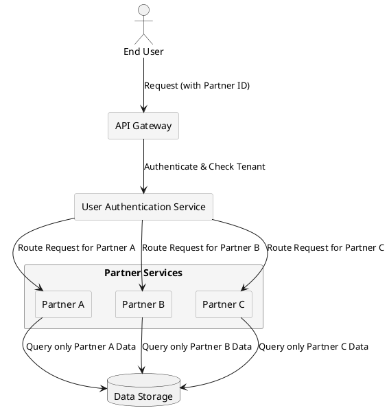

# **Multi-Tenancy & Data Isolation**

## **Overview**

In a multi-tenant system, **Partner-Specific Isolation** is a critical security and architectural requirement. Each partner (provider) has **its own isolated user base, configurations, and data**, ensuring that:

- **Users from different partners never overlap.**

- **Each partner’s access rules, feature sets, and user roles are independently configured.**

- **Data isolation is enforced at both the application and database levels.**

- **Security policies prevent unauthorized cross-tenant access.**

Additionally, **subscription plans** are mapped per partner, meaning:

- Each partner controls **which subscription plans** are **available** to its users.

- **User role restrictions** define eligibility for specific plans.

- A user’s **subscription status (`signing`, `confirmed`, `suspended`)** is **isolated within the partner context**.

For details on **subscription plan mapping**, see [Subscription & Service Plan Control](../subscriptions/plan_restrictions.md).

---

## **Key Principles of Multi-Tenant Isolation**

### **1. Data Isolation**

To prevent unintended access between tenants, the system enforces strict **data segregation** through:

- **Logical Database Separation** → Each partner's data is tagged with a unique `partner_id`.

- **Row-Level Security (RLS)** → Queries automatically filter data based on the authenticated partner.

- **Scoped API Requests** → API responses are restricted to the requesting partner's context.

- **Subscription Plan Data Segmentation** → Users can **only subscribe to plans** within their assigned partner.

---

### **2. User Base Segmentation**

To ensure that users remain within their designated tenant environments:

- Each partner defines **its own set of users**, including **authentication rules** and **role configurations**.

- Users **cannot see or interact** with accounts from another partner.

- **Guest users must complete KYC** before they are eligible to access **partner-defined subscription plans**.

- The system prevents **accidental cross-tenant access** via strict **Role-Based Access Control (RBAC)**.

For more details, see [User Roles and Transitions](../security/rbac.md).

---

### **3. Feature & Access Configuration**

To provide partners with flexibility while maintaining isolation:

- Partners can **enable or disable** specific system features for their users.

- **Role-based access control (RBAC)** enforces granular permissions per user, with role definitions configurable per partner.

- KYC verification is required for users transitioning from Guest to Basic. Additional role upgrades (Basic to Advanced, Advanced to Company) may be subject to partner-specific policies.

- **Subscription access is restricted** → Partners define:
  
  - Which **user roles** can subscribe.
  
  - The **process flow** (`signing` → `confirmed` → `suspended`).

- **Feature toggles** allow partners to dynamically enable or disable functionalities.

For more details, see [User Roles and Transitions](../security/rbac.md).

---

### **4. API Gateway & Authentication Isolation**

To enforce partner-level request isolation:

- Requests must **always include tenant identifiers** to ensure proper routing.

- API calls enforce **partner-specific authentication rules** (e.g., OAuth2, JWT, API Keys).

- Tenants may use **custom authentication providers**, requiring dynamic validation.

- Subscription-related API requests **must validate**:
  
  - **User role eligibility** for the requested plan.
  
  - **Partner’s authorization policies** before confirming a subscription.

For API structure details, refer to [OpenAPI Specification](../../task2/openapi.yaml).

---

## **Multi-Tenant Isolation Flow**

The following diagram illustrates how multi-tenancy is enforced at various system levels.

---

## **Data Isolation Mechanisms**

| **Isolation Layer**       | **Enforcement Mechanism** |
|---------------------------|--------------------------|
| **Database Isolation** | **Row-Level Security (RLS) & Schema Separation** |
| **User Segmentation** | **Partner-Specific Authentication & Role-Based Access** |
| **Feature Control** | **Per-Tenant Feature Flags & Access Rules** |
| **Session Management** | **Tenant-Aware Session Tracking** |
| **API Request Filtering** | **Scoped API Responses Based on Tenant Context** |
| **Subscription Restrictions** | **Plan availability controlled per partner** |

---

## **Summary**

**Partner-Specific Isolation** is a fundamental aspect of our **multi-tenant system**. By enforcing **strict data separation, role-based access control, and tenant-aware API filtering**, we ensure:

- **Security** → No unauthorized cross-tenant access.

- **Scalability** → New partners onboard without affecting existing ones.

- **Customization** → Partners configure **features, authentication, and user roles** independently.

- **Subscription Integrity** → Users can only subscribe to plans within their **partner’s allowed scope**.

---

## **For More Details, See:**

- **[User Roles and Transitions](../security/rbac.md)**

- **[User Management Model](../architecture/user_management.md)**

- **[Multi-Tenancy Overview](../why_multi_tenancy.md)**

- **[Plan Availability and Partner Restrictions](../subscriptions/plan_restrictions.md)**

- **[OpenAPI Specification](../../task2/openapi.yaml)**
