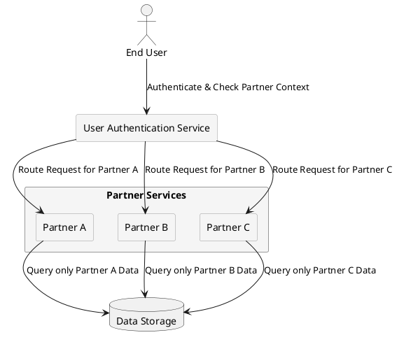

# Multi-Tenancy & Data Isolation

## Overview

In a multi-tenant system, partner-specific isolation is a crucial security and architectural requirement. Each partner (provider) has its own isolated user base, configurations, and data, ensuring that:

- Users from different partners never overlap.  
- Each partner’s access rules, feature sets, and user roles are independently configured.  
- Data isolation is enforced at both the application and database levels.  
- Security policies prevent unauthorized cross-tenant access.  

Additionally, subscription plans are mapped per partner, meaning:

- Each partner controls which subscription plans are available to its users.  
- User role restrictions define eligibility for specific plans.  

For details on subscription plan mapping, see [Subscription Management and Lifecycle](../subscription_management.md).

---

## Key Principles of Multi-Tenant Isolation

### Data Isolation

To prevent unintended access between tenants, the system enforces strict data segregation through:

- **Logical database separation** → Each partner's data is tagged with a unique ID (`provider_id`).  
- **Row-Level Security (RLS)** → Queries automatically filter data based on the authenticated partner.  
- **Scoped API requests** → API responses are restricted to the requesting partner's context.  
- **Subscription plan data segmentation** → Users can only subscribe to plans within their assigned partner.  

---

### User Base Segmentation

To ensure that users remain within their designated tenant environments:

- Each partner defines its own set of users, including authentication rules and role configurations.  
- Users cannot see or interact with accounts from another partner.  
- Guest users must complete KYC before they are eligible to access partner-defined subscription plans.  
- The system prevents accidental cross-tenant access via strict role-based access control (RBAC).  

For more details, see [User Roles and Transitions](../security/rbac.md).

---

### Feature & Access Configuration

To provide partners with flexibility while maintaining isolation:

- Partners can enable or disable specific system features for their users.  
- Role-based access control (RBAC) enforces granular permissions per user, with role definitions configurable per partner.  
- KYC verification is required for users transitioning from `guest` to `basic`. Additional role upgrades (`basic` to `advanced`, `advanced` to `company`) may be subject to partner-specific policies.  
- Subscription access is restricted based on partner-defined rules:  

    - Which user roles can subscribe.  
    - The subscription process flow (`signing → signed → suspended → unsigned`).  

- Feature toggles allow partners to dynamically enable or disable functionalities.  

For more details, see [User Roles and Transitions](../security/rbac.md).

---

## Multi-Tenant Isolation Flow

The following diagram illustrates how multi-tenancy is enforced at various system levels.

---

## Data Isolation Mechanisms

| Isolation Layer | Enforcement Mechanism |
|----------------|----------------------|
| Database Isolation | Row-Level Security (RLS) & Schema Separation |
| User Segmentation | Partner-Specific Authentication & Role-Based Access |
| Feature Control | Per-Tenant Feature Flags & Access Rules |
| Session Management | Tenant-Aware Session Tracking |
| API Request Filtering | Scoped API Responses Based on Tenant Context |
| Subscription Restrictions | Plan availability controlled per partner |

---

## Related Sections:

- [Role-Based Access Control (RBAC)](rbac.md)
- [User Management Model](../architecture/user_management.md)
- [Partner Management Model](../architecture/partner_management.md)
- [Understanding the Multi-Tenant Architecture](../why_multi_tenancy.md)

---

© 2025 CompanyName. Internal use only.
