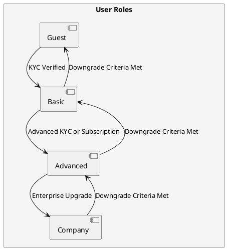

# **User Roles and Transitions**

## **Overview**

User roles define the **access permissions, session policies, and transition rules** for users across multiple partners. The system allows **role-based access control (RBAC) while maintaining flexibility** for partner-specific configurations.

The **User Roles and Transitions model** ensures that:

- **Users have the least privileges necessary** for their role.
- **Partners can customize role-based access** within their environments.
- **Dynamic role transitions** allow users to **upgrade or downgrade based on predefined conditions**.

---

## **Key User Roles**

Each user is assigned a **role** that determines their **permissions and operational limits**.

| **Role**      | **Description** | **Permissions & Restrictions** |
|--------------|----------------|--------------------------------|
| **Guest** | Temporary user with limited access. | - **Session expiry:** 20 min <br> - **Daily limit:** 5 operations <br> - **Weekly limit:** 20 operations <br> - **Upgrade to Basic after KYC** |
| **Basic** | Verified user after KYC approval. | - **Session expiry:** On inactivity (partner-defined) <br> - **Daily limit:** 20 operations <br> - **Weekly limit:** 50 operations <br> - **Eligible for Advanced upgrade** |
| **Advanced** | Fully verified user with unrestricted access to system resources. | - No session/operation limits <br>- Access to features is determined by partner policies <br> - Eligible for Company upgrade |
| **Company** | Enterprise-level user with expanded permissions. | - No session/operation limits <br> - Access to features is determined by partner policies <br> - Highest level of access allowed per partner configuration |
| **Admin** | System administrator. | - Cannot subscribe to plans <br> - Manages system settings & user permissions |

Each **partner can customize role configurations** based on their specific business needs.

---

## **Permissions and Access Control**

Permissions determine **what actions a user can perform**, classified into:

- **General Access** – Ability to **log in, reset passwords, and access dashboards**.
- **Operational Controls** – Execution of **transactions, API calls, and system actions**.
- **Administrative Privileges** – **Managing users, adjusting configurations, and accessing reports**.

Permissions are **partner-defined** and **enforced dynamically** within the system.

---

## **Role Transition Model**

Users can **move between roles** based on **verification, system limits, or administrative approvals**.



---

## **Role Transitions**

- **Guest** users must **pass KYC verification** to upgrade to **Basic**.
- **Basic** users can upgrade to **Advanced** if allowed by **partner policies**.

  - Partners may require **Advanced KYC verification** to ensure compliance.  
  - Some partners may offer **subscription-based upgrades** to unlock **Advanced** status.  
  - Certain partners may allow an **automatic upgrade** based on **user activity or transaction volume**.

- **Advanced** users can transition to **Company** status if they meet **enterprise-level requirements**.

  - This may include **business verification, corporate onboarding, or admin approval**.

---

## **Downgrade Criteria**

A user may be downgraded under the following conditions:

- **Failure to Maintain Compliance** → If a KYC or verification document expires or is revoked.
- **Manual Downgrade** → If an admin manually revokes access due to policy enforcement.
- **Subscription Expiry (if applicable)** → If a role is tied to subscription status and the user fails to renew.
- **Partner-Defined Policies** → Certain partners may implement additional downgrade conditions based on security or business needs.

> **Inactivity does not trigger a downgrade** but simply **terminates sessions, requiring users to log in again**.

Each partner can define their own downgrade policies while maintaining global security and compliance standards.

---

## **User Role Enforcement in the Multi-Tenant System**

RBAC is implemented at **multiple levels** to ensure **security and isolation** across partners.

| **Enforcement Layer**   | **Mechanism** |
|--------------------|-----------|
| **Application Layer**  | **Role-based UI rendering** (users only see features they have access to) |
| **API Layer**  | **Role-scoped API permissions** (users can only call endpoints they are authorized for) |
| **Database Layer** | **Row-Level Security (RLS)** (data access limited based on user role & tenant ID) |
| **Session Layer**  | **Enforced session limits** for Guest & Basic users |

All **role-based controls are dynamically applied** based on the **user’s session, role, and partner settings**.

---

## **Example Role-Based Access Policy (JSON)**

Role-based access controls (RBAC) are managed by the Session & Usage Policy Manager, ensuring enforcement of session limits, role transitions, and API access policies.

```json
{
  "role": "basic",
  "permissions": {
    "view_dashboard": true,
    "execute_transactions": true,
    "manage_users": false,
    "api_access_level": "limited"
  },
  "session_limits": {
    "inactivity_timeout_min": 30,
    "max_operations_per_day": 20,
    "max_operations_per_week": 50
  }
}
```

Each partner can override role-based rules to meet their security and operational requirements.

---

## **Summary**

The **User Roles and Transitions model** ensures that **multi-tenant environments maintain structured access control** while allowing **customization per partner**. By enforcing **least privilege, dynamic role transitions, and session limits**, the system:

- **Prevents unauthorized access** to sensitive features.
- **Supports scalable multi-tenant role management**.
- **Allows role upgrades and downgrades** based on compliance, policies, and user actions.

---

## **Related Sections**

- [User Role Transitions](../users/user_status_transitions.md)
- [Partner-Specific Isolation](../security/multi_tenancy.md)
- [User Management Model](../architecture/user_management.md)
