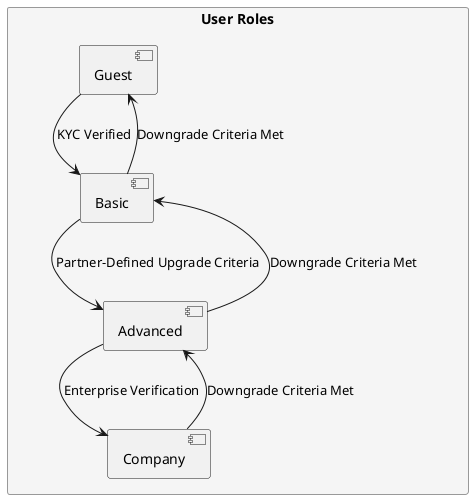

# User Roles and Transitions

## Overview

User roles define access permissions, session policies, and transition rules for users across multiple partners. The system allows role-based access control (RBAC) while maintaining flexibility for partner-specific configurations.

The User Roles and Transitions model ensures that:

- Partners can customize role-based access within their environments.  
- Dynamic role transitions allow users to upgrade or downgrade based on predefined conditions.  

---

## Key User Roles

Each user is assigned a role (`type`) that determines their permissions and operational limits.

| Role      | Description | Permissions & Restrictions |
|-----------|------------|----------------------------|
| `guest`   | Temporary user with limited access. | - Session expiry: 20 min <br> - Daily limit: 5 operations <br> - Weekly limit: 20 operations <br> - Upgrade to Basic after KYC |
| `basic`   | Verified user after KYC approval. | - Session expiry: Partner-defined <br> - Daily limit: 20 operations <br> - Weekly limit: 50 operations <br> - Eligible for Advanced upgrade |
| `advanced` | Fully verified user with expanded access. | - No session/operation limits <br> - Access to features defined by partner policies <br> - Eligible for Company upgrade |
| `company` | Enterprise-tier user. | - No session/operation limits <br> - Access to features based on partner policies |
| `admin`   | System administrator. | - Cannot subscribe to plans <br> - Manages system settings & user permissions |

Each partner can customize role configurations based on their specific business needs.

---

## Permissions and Access Control

Permissions determine what actions a user can perform, classified into:

- **General Access** – Logging in, resetting passwords, and viewing dashboards.  
- **Operational Controls** – Executing transactions, making API calls, and performing system actions.  
- **Administrative Privileges** – Managing users, adjusting configurations, and accessing reports.  

Permissions are partner-defined and enforced dynamically.

---

## Role Transition Model

Users can move between roles based on verification, system limits, or administrative approvals.



---

## Role Transitions

- **Guest** users must pass KYC verification to upgrade to **Basic**.  
- **Basic** users can upgrade to **Advanced** if allowed by partner policies: some partners may require additional KYC verification for the upgrade.  
- **Advanced** users can transition to **Company** status if they meet enterprise-grade requirements, which may include:  

    - Business verification, corporate onboarding, or admin approval.  

---

## Downgrade Criteria

A user may be downgraded under the following conditions:

- **Non-compliance** → KYC or verification documents expire or are revoked.  
- **Manual Downgrade** → Admin intervention due to policy enforcement.  
- **Partner-Defined Policies** → Additional downgrade conditions based on security or business needs.  

> Inactivity does not trigger a downgrade but may terminate sessions, requiring users to log in again.

Each partner can define their own downgrade policies while maintaining global security and compliance standards.

---

## User Role Enforcement in the Multi-Tenant System

RBAC is implemented at multiple levels to ensure security and isolation across partners.

| Enforcement Layer   | Mechanism |
|--------------------|-----------|
| **Application Layer**  | Role-based UI rendering (users only see features they have access to) |
| **API Layer**  | Role-scoped API permissions (users can only call endpoints they are authorized for) |
| **Database Layer** | Row-Level Security (RLS) (data access limited based on user role & provider ID) |
| **Session Layer**  | Enforced session limits for Guest & Basic users |

All role-based controls are dynamically applied based on the user’s session, role, and partner settings.

---

## Example Role-Based Access Policy (JSON)

RBAC is managed by the system, ensuring enforcement of session limits, role transitions, and API access policies.

```json
{
  "role": "basic",
  "permissions": {
    "view_dashboard": true,
    "execute_transactions": true,
    "manage_users": false,
    "api_access_level": "limited"
  },
  "session_limits": {
    "inactivity_timeout_min": 30,
    "max_operations_per_day": 20,
    "max_operations_per_week": 50
  }
}
```

Each partner can override role-based rules to meet their security and operational requirements.

---

## Related Sections:

- [User Management Model](../architecture/user_management.md)
- [Multi-Tenancy and Data Isolation](multi_tenancy.md)