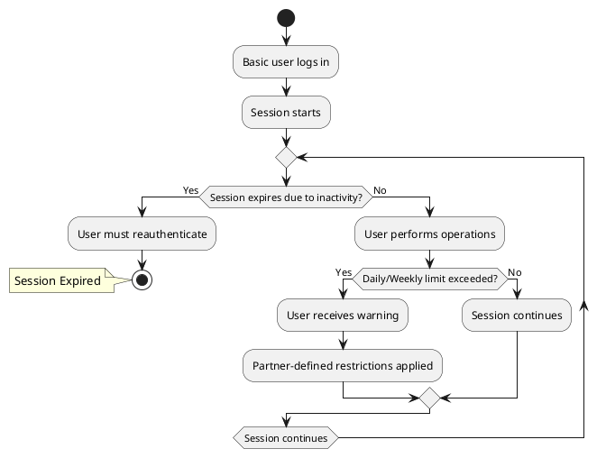

# Basic Session Management

## Overview

`Basic` users have more flexible session policies than `guest` users because they have completed KYC verification. They also gain access to subscription plans, which may influence session management depending on partner policies.

While operation limits remain system-wide, the restrictions for exceeding these limits are partner-defined.

This section explains session expiration rules, operation limits, enforcement mechanisms, and subscription-related impacts for `basic` users.

---

## Session Duration

Unlike `guest` users, `basic` users do not have a fixed session expiration limit (e.g., 20 minutes per session). However:

- Sessions remain active until:
    - The user logs out manually.  
    - An inactivity timeout occurs (configurable per partner).  
- After a defined period of inactivity, the session automatically expires for security reasons.  
- Reauthentication is required after expiration.  

Some subscription plans may introduce different session policies, such as:

- Longer session durations for premium plans.  
- Persistent sessions for enterprise accounts.  

This balances usability and security, allowing continuous sessions while protecting against unauthorized access.

---

## Operation Limits

Basic users have higher operation quotas than Guest users:

- Maximum **20 operations per day**.  
- Maximum **50 operations in a rolling 7-day period**.  

> These limits are system-wide and apply to all basic users. However, each partner defines how exceeding these limits is handled.

## Enforcement When Limits Are Exceeded (Partner-Defined)

If a Basic user exceeds operation limits, they are not automatically blocked like Guest users. Instead, partners define how enforcement is handled.

### Possible Enforcement Actions

- **Warning notifications** – The user is informed they are approaching or exceeding limits.  
- **Rate-limiting** – Operations may be slowed down instead of blocked.  
- **Temporary feature restrictions** – Certain actions may be disabled until limits reset.  
- **Manual review or admin intervention** – Some partners may require approval to restore full access.  
- **Cooldown periods** – The user may need to wait before regaining full access.  
- **Subscription-dependent actions** – Some plans may offer priority access or grace periods.  

This flexibility ensures that partners can implement controls that fit their risk and business requirements.

---

## Basic Session Flow Diagram

The following diagram illustrates how a Basic user session is managed.

---

## Related Sections:

- [User Roles & Transitions](../security/rbac.md)  
- [Subscription Management and Lifecycle](../subscription_management.md) 

---

© 2025 CompanyName. Internal use only.
