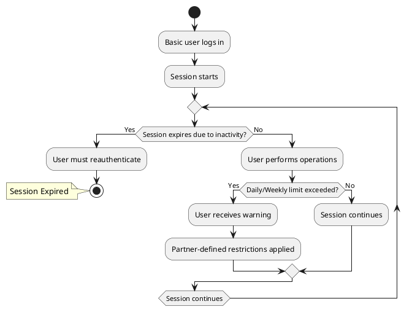

# **Basic Session Management**

## **Overview**

Basic users have **more flexible session policies** than Guest users because they **have completed KYC verification**. They also **gain access to subscription plans**, which may **influence session management** depending on partner policies.

While **operation limits remain system-wide**, the **restrictions for exceeding these limits** are **partner-defined**.

This section explains **session expiration rules, operation limits, enforcement mechanisms, and subscription-related impacts** for Basic users.

---

## **Session Duration**

Unlike Guest users, Basic users **do not have a fixed session expiration limit** (e.g., 20 minutes per session). However:

- **Sessions remain active** until:
  - The user **logs out manually**.
  - An **inactivity timeout** occurs (configurable per partner).
- After **X minutes/hours of inactivity**, the session **automatically expires** for security reasons.
- **Reauthentication is required** after expiration.

Additionally, some **subscription plans may introduce different session policies**, such as:

- **Longer session durations** for premium plans.
- **Persistent sessions** for enterprise accounts.

This **balances usability and security**, allowing **continuous sessions while protecting against unauthorized access**.

---

## **Operation Limits**

Basic users have **higher operation quotas** than Guest users:

- **Maximum 20 operations per day**.
- **Maximum 50 operations in a rolling 7-day period**.

> **These limits are system-wide** and apply to all Basic users. However, each partner **defines how exceeding these limits is handled**.

### **Subscription Plans & Operation Limits**
- Some **subscription plans may modify operation limits** for Basic users.
- Example: A **Premium plan** could allow **higher daily/weekly operation quotas**.
- Operation limits remain **system-wide but adaptable** through partner-defined policies.

---

## **Enforcement When Limits Are Exceeded (Partner-Defined)**

If a Basic user **exceeds operation limits**, they **are not automatically blocked** like Guest users. Instead, **partners define how enforcement is handled**.

### **Possible Enforcement Actions**
- **Warning notifications** → The user is informed they are approaching/exceeding limits.
- **Rate-limiting** → Operations may be slowed down instead of blocked.
- **Temporary feature restrictions** → Certain actions may be disabled until limits reset.
- **Manual review or admin intervention** → Some partners may require approval to restore full access.
- **Cooldown periods** → The user may need to wait before regaining full access.
- **Subscription-Dependent Actions** → Some plans may offer **priority access** or **grace periods**.

This **flexibility ensures** that partners can **implement controls that fit their risk and business requirements**.

---

## **Subscription & Session Impact**

A **Basic user’s subscription state** may also **affect their session and operation rules**:

| **Subscription Status** | **Impact on Session & Operations** |
|----------------------|--------------------------------|
| **Unsigned** | Standard Basic session rules apply. |
| **Signing** | Temporary restrictions may apply during subscription processing. |
| **Signed** | Partner/subscription plan may extend session duration or increase limits. |

This ensures that **users with active subscriptions may receive additional benefits**, such as **higher operation limits or longer session retention**.

---

## **Basic Session Flow Diagram**

The following diagram illustrates **how a Basic user session is managed**:

---

## **Summary**

Basic session policies **offer greater flexibility** while ensuring **system-wide operation limits** remain in place.

| **Policy**                      | **Restriction** |
|----------------------------------|----------------|
| **Session Expiration**           | No fixed limit; expires on inactivity (partner-defined) |
| **Operation Limits**             | 20 per day, 50 per week (system-wide) |
| **Exceeding Limits Consequence** | Partner-defined enforcement (warnings, rate-limiting, feature restrictions) |
| **Idle State Enforcement**       | Not enforced |
| **Subscription Impact**          | Some plans may extend session durations or modify operation limits |

The **partner-controlled enforcement mechanisms** allow **customization while maintaining system-wide consistency**.

For more details on **user transitions, RBAC, and subscription management**, see:

- [User Roles & Transitions](../security/rbac.md)
- [Subscription Plans & Partner Restrictions](../subscriptions/plan_restrictions.md)
- [Subscription Lifecycle](../subscriptions/subscription_lifecycle.md)

---

## **License and Ownership**
© 2025 CompanyName. Internal use only.
