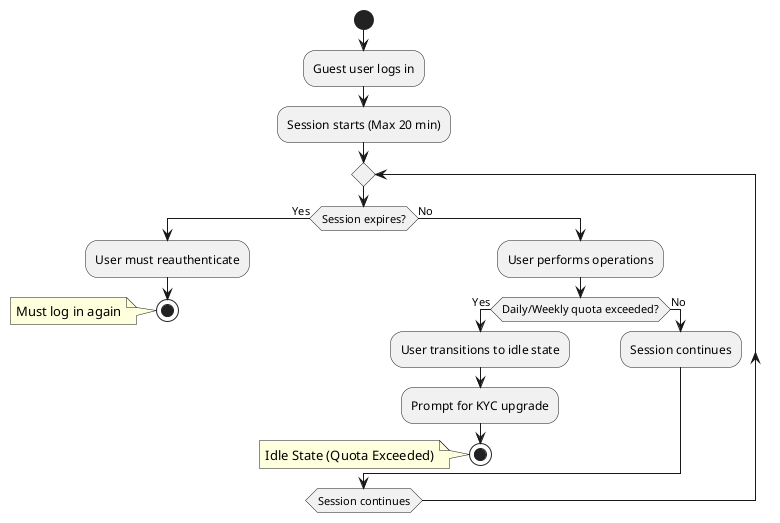

# Guest Session Management

## Overview

Guest users operate under **strict, system-wide session policies** to ensure **security, prevent abuse, and encourage KYC verification**. These restrictions apply **uniformly across all partners** and cannot be modified.

The system enforces **session duration limits, operation quotas, and idle state enforcement** to:

- **Prevent fraudulent or anonymous misuse** of system resources.
- **Encourage users to verify their identities** through KYC.
- **Ensure fair resource distribution** among guest users.

Because Guest users **lack verified identities**, these controls serve as **protective measures** for both the system and legitimate users.

---

## Session Duration Limit

- **Each session for a Guest user is limited to 20 minutes.**
- After 20 minutes, the session **automatically expires**, requiring the user to **log in again**.
- **Sessions do not accumulate**—users can start new sessions but must **re-authenticate each time**.
- This **prevents unverified users from maintaining persistent access**, ensuring that periodic re-authentication is enforced.

---

## Operation Quotas

Guest users are also subject to **strict operation quotas**:

- **Maximum 5 operations per day.**
- **Maximum 20 operations in a rolling 7-day period.**
- **Operations include API requests, transactions, and key system interactions**.

If a Guest user **exceeds any of these quotas**, they **immediately transition into Idle State**.

---

## Idle State Enforcement

**Idle State** is a **strict system-wide restriction** applied when a Guest user **exceeds session or operation quotas**. This means:

- **The user is immediately blocked from performing further actions** until the next reset period.
- **They are prompted to complete KYC verification** to upgrade to **Basic** and regain full access.
- **Idle State cannot be bypassed** unless the user either **waits for the reset period** or **upgrades to Basic**.

---

## Guest Session Flow Diagram

The following diagram illustrates the lifecycle of a Guest session:

---

## Enforcing KYC Completion

The **Guest session model** is intentionally restrictive to drive users toward KYC verification:

- **Frequent session expirations** encourage users to verify their identity and upgrade to **Basic** status.
- **Operation quotas** prevent Guest users from **overusing the system** while allowing limited interaction.
- **Idle state enforces a strong conversion incentive**—users must either **wait for quotas to reset** or **complete KYC** to continue.

By applying these policies, the system ensures that **Guest users do not remain unverified indefinitely**.

---

## Summary

Guest session policies are **strictly enforced** across all partners to **maintain security, system integrity, and encourage KYC adoption**.

| **Policy**                    | **Restriction**                              |
|--------------------------------|----------------------------------------------|
| **Session Expiration**         | 20 min per session                          |
| **Operation Quotas**           | 5 per day, 20 per week                      |
| **Exceeding Quotas Consequence** | Immediate **Idle State** (No further actions allowed) |
| **Escape from Idle State**     | Wait for reset **OR** Complete KYC          |

For more details on user transitions, see:

- [User Roles and Transitions](../security/rbac.md)
