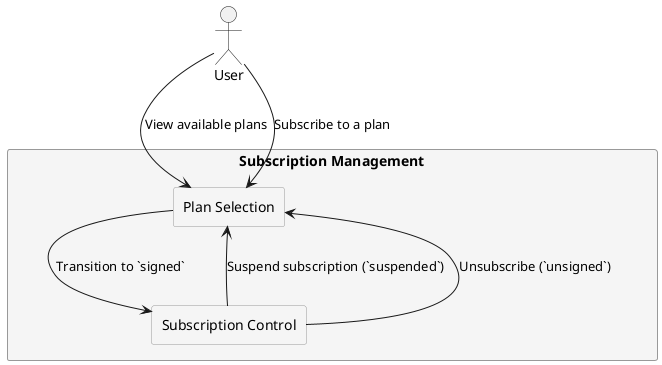

# Subscription Management and Lifecycle

## Overview

Subscription plans allow users to access features based on their role and partner-defined policies. Each partner manages its own set of plans, controlling availability, pricing, and eligibility.  

The system enforces strict plan assignment, lifecycle management, and eligibility rules to ensure:  

- Plans are tied to a specific partner (no cross-partner access).  
- Users can subscribe to only one plan at a time.  
- Eligibility is role-based (`guest`/`admin` cannot subscribe).  
- Subscriptions follow a structured lifecycle (`absent → signed → suspended → unsigned`).  

---

## Plan Availability by User Role

| **User Role**  | **Subscription Eligibility**  | **Notes** |
|---------------|------------------------------|-----------|
| `guest`       | ❌ Not eligible              | Must complete KYC verification to subscribe. |
| `basic`       | ✅ Eligible for certain plans | Can only subscribe to plans mapped to `basic`. |
| `advanced`    | ✅ Eligible for more plans   | Can access plans for `basic` and `advanced` users. |
| `company`     | ✅ Full access               | Can access all plans, including enterprise-level offerings. |
| `admin`       | ❌ Not eligible              | Admins manage plans but cannot subscribe. |

- Partners define which plans are available for each role.  
- Upgrades/downgrades impact available plans (e.g., `basic → advanced` unlocks more plans).  

---

## Subscription Lifecycle

A user’s subscription follows a structured status model:

| **Status**     | **Description** |
|---------------|-----------------------------------------------------------|
| `absent`      | The user has never subscribed to a plan. |
| `signed`      | The subscription is active, and the user has full access to the plan's features. |
| `unsigned`    | The user was previously subscribed but has no active plan. |
| `suspended`   | The subscription is temporarily disabled due to payment issues, policy violations, or admin actions. |

- New users start in the `absent` state.  
- When a user subscribes, they transition directly from `absent` to `signed`.  
- If they unsubscribe or are removed from a plan, they transition to `unsigned`.  
- A suspended subscription can either return to `signed` or transition to `unsigned`.  

---

## Partner-Specific Subscription Management

Each partner manages its own set of subscription plans. The system prevents cross-partner access by enforcing strict mapping rules:

- Each plan belongs to a single partner.  
- Users can only subscribe to plans offered by their assigned partner.  
- Partners control pricing, features, and subscription conditions for their plans.  

This ensures that each partner retains full control over their pricing, business logic, and feature access.

---

## Subscription Transitions & Enforcement

The system enforces the following hard limits on subscriptions:

- Users can only subscribe to one plan at a time.  
- Switching plans requires unsubscribing first (unless explicitly allowed by partner policies).  
- Partners can modify or remove plans, affecting currently subscribed users.  

If a plan is discontinued, users may be forcibly unsubscribed, transitioning them to `unsigned`.

---

## Subscription Flow Diagram

The following diagram illustrates how users interact with subscription plans and the restrictions enforced:

---

© 2025 CompanyName. Internal use only.
