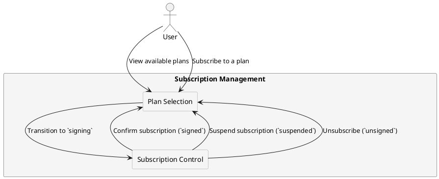

# **Plan Availability & Partner Restrictions**

## **Overview**

Subscription plans are **configured per partner**, ensuring that **only eligible users** can access them. Each partner can create, modify, and restrict plans **based on user roles and internal policies**. 

The system **enforces plan availability rules** through **partner-defined mappings**, ensuring that:

- **Not all plans are available to every user**—eligibility depends on user role.
- **Plans are tied to specific partners**—a plan created by one partner is **not accessible** to another.
- **Users can subscribe to only one plan at a time**.
- **Subscription status transitions follow a structured model** (`signing → signed → suspended`).

This document explains how **plan restrictions are enforced** and the **rules governing their availability**.

---

## **Plan Availability by User Role**

Each **subscription plan** is mapped to specific **user roles** (`basic`, `advanced`, `company`). The **Guest** and **Admin** roles **cannot subscribe** to any plans.

| **User Role**  | **Subscription Eligibility**  | **Notes** |
|---------------|------------------------------|----------|
| **Guest**     | ❌ **Not eligible**            | Must complete **KYC verification** to access plans. |
| **Basic**     | ✅ **Eligible for certain plans** | Can only subscribe to plans mapped to `basic`. |
| **Advanced**  | ✅ **Eligible for more plans** | Can access plans for `basic` and `advanced` users. |
| **Company**   | ✅ **Full access**              | Can access all plans, including enterprise-level offerings. |
| **Admin**     | ❌ **Not eligible**            | Admins manage plans but cannot subscribe. |

- Partners can **create plans that target multiple user roles**.
- If a **Basic user upgrades to Advanced**, they may **gain access to new plans**.
- If a user **downgrades back to Basic**, they **may lose access** to previously available plans.

---

## **Partner-Specific Plan Restrictions**

Each **partner** manages their own set of **subscription plans**. The system prevents **cross-partner access** by enforcing **strict mapping rules**:

- **Each plan belongs to a single partner.**
- **Users can only subscribe to plans offered by their assigned partner.**
- **Partners control pricing, features, and subscription conditions for their plans.**
- **Subscription status follows a structured lifecycle** (`signing → signed → suspended`).

### **Example: Cross-Partner Plan Isolation**

- **Partner A** offers a plan **"Pro Access"** → Only available to **Partner A's users**.
- **Partner B** offers **"Enterprise Suite"** → Cannot be accessed by **Partner A's users**.

This ensures that **each partner retains full control over their pricing, business logic, and feature access**.

---

## **Subscription Constraints & Enforcement**

The system enforces the following **hard limits** on subscriptions:

- **Users can only subscribe to one plan at a time.**
- **Switching plans requires unsubscribing first** (unless explicitly allowed by partner policies).
- **Subscription plans cannot be transferred between partners.**
- **Partners can modify or remove plans**, affecting currently subscribed users.

If a plan is **discontinued**, users may be **forcibly unsubscribed**, transitioning them to an **"unsigned"** status.

---

## **Subscription Flow Diagram**

The following diagram illustrates how **users interact with subscription plans** and the **restrictions enforced**:

---

## **Summary**

- **Subscription plans are assigned to specific partners and user roles.**
- **Guest and Admin users cannot subscribe**—only Basic, Advanced, and Company users are eligible.
- **Each partner fully controls their subscription plans**—including pricing, access rules, and feature sets.
- **Users can only have one active subscription at a time**.
- **Switching plans or modifying existing plans requires partner-defined policies**.
- **Subscription transitions follow the `signing → signed → suspended` lifecycle**.

For more details, see:

- [Subscription Plans and User Types](./subscription-plans.md)
- [Subscription Lifecycle](./subscription-lifecycle.md)
