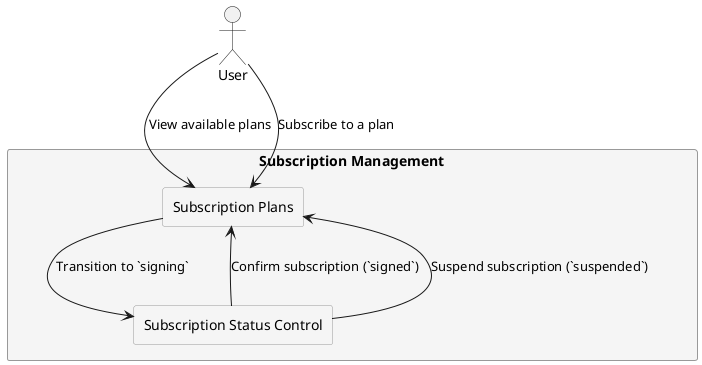

# **Subscription Plans and User Types**

## **Overview**

The system supports **subscription-based service plans**, allowing users to access specific features based on their role and partner-defined policies. Subscription plans are **configurable per partner**, ensuring that:

- **Users can subscribe to only one plan at a time** (or remain unsubscribed).
- **Each partner manages their own set of subscription plans**, defining availability and access restrictions.
- **Plans are mapped to specific user roles**, restricting eligibility.
- **Subscriptions follow a structured lifecycle**, transitioning between `signing`, `signed`, and `suspended` statuses.

This section explains **how subscription plans are created, managed, and enforced** within the system.

---

## **Subscription Plan Structure**

Each subscription plan has **the following attributes**:

| **Attribute**       | **Description**                                               |
|---------------------|---------------------------------------------------------------|
| **Plan ID**        | Unique identifier for the subscription plan.                   |
| **Name**           | Human-readable name of the plan (e.g., "Premium", "Business"). |
| **Available For**  | User roles eligible for this plan (`basic`, `company`, `advanced`). |
| **Partner-Specific** | Subscription plans are only available within the partner that created them. |
| **Plan Status**    | Indicates if the plan is `active` or `inactive`. |

> **Guest and Admin users cannot subscribe to plans.** Guest users must **first complete KYC verification** to become eligible.

---

## **Subscription Lifecycle**

A user’s subscription follows a **structured status model**:

| **Status**     | **Description**                                           |
|---------------|-----------------------------------------------------------|
| **Signing**   | The user has initiated a subscription request.             |
| **Signed**    | The subscription is active and fully functional.           |
| **Suspended** | The subscription is temporarily disabled by the partner.   |

- **New subscriptions begin in the `signing` state** until they are **confirmed as `signed`**.
- Partners may **suspend subscriptions**, temporarily restricting access **without removing the user from the plan**.
- Users can only **switch plans after unsubscribing from their current plan**.

---

## **Partner-Controlled Subscription Management**

Partners have **full control** over how subscriptions are managed, including:

### **1. Subscription Plan Availability**
- Partners define which **plans are available for each user role**.
- Users **can only subscribe to plans mapped to their role**.
- Subscription plans **cannot be shared between partners**.

### **2. Plan Modification and Deletion**
- Partners **can create, update, or delete subscription plans**.
- Plan modifications **do not affect active subscriptions** unless explicitly enforced.

### **3. Enforcing Subscription Policies**
- Partners **define custom restrictions** on **subscription upgrades, downgrades, and renewals**.
- Subscription changes may require **manual approval** or **automatic validation**.

---

## **Subscription Plan API Integration**

Partners interact with subscription plans via the **Subscription API**. The key endpoints include:

| **Method** | **Endpoint** | **Description** |
|-----------|-------------|-----------------|
| **GET**   | `/api/subscriptions/plans` | Retrieve available plans for a partner. |
| **POST**  | `/api/subscriptions/plans` | Create a new subscription plan (**requires Basic Auth**). |
| **PUT**   | `/api/subscriptions/plans/{plan_id}` | Update an existing plan (**requires Basic Auth**). |
| **DELETE**| `/api/subscriptions/plans/{plan_id}` | Remove a subscription plan (**requires Basic Auth**). |
| **POST**  | `/api/subscriptions/{user_id}/subscribe/{plan_id}` | Subscribe a user to a plan, transitioning them to `signing`. |
| **POST**  | `/api/subscriptions/{user_id}/confirm/{plan_id}` | Confirm a user’s subscription, changing `signing → signed`. |
| **POST**  | `/api/subscriptions/{user_id}/unsubscribe` | Cancel a subscription, transitioning the user to `unsigned`. |

For full API details, see [Subscription API Specification](../../task2/index.md).

---

## **Subscription Flow Diagram**

The following diagram illustrates the **subscription lifecycle** and how users interact with subscription plans:

---

## **Summary**

Subscription plans provide a **structured, partner-managed way** for users to access premium features. The system ensures that:

- **Users can only have one active subscription at a time**.
- **Plans are available based on role eligibility**.
- **Guest and Admin users cannot subscribe to plans**.
- **Partners manage subscription creation, modification, and enforcement**.
- **Subscription transitions follow the `signing → signed → suspended` lifecycle**.

For implementation details, see:

- [Subscription API](../api/subscription-api.md)
- [User Role Transitions](../users/user_status_transitions.md)
- [Partner Management Model](../architecture/partner_management.md)
